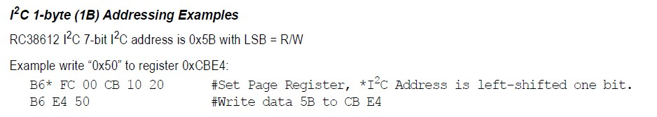
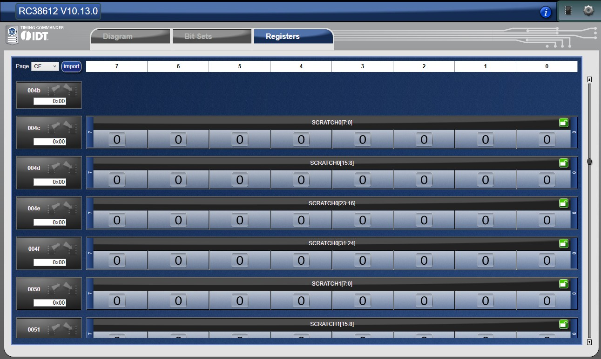

# Renesas RC38612 I2C Programming (And Perl Script Bug)

**Date:** 2026-05-06
**Commit:** `1c9d7199`

## Background and Goal

Working on programming the Renesas RC38612 jitter cleaner chip. To verify success of the provided *Renesas_I2C_Programming* example, we implemented an `i2c_axi_sequencer` module to enable I2C r/w to the JC chip.

After the last issue (see *2026-05-03_renesas_i2c_page_select.md*) we implemented a page-select I2C r/w using register **0xFC**. This r/w functionality works as intended.

Using this user I2C r/w, we can verify that the RC38612 chip is getting programmed correctly by the **BRAM + state machine** logic. The test procedure is:

1. **Corrupt** — Write a known value (e.g. `0xFF`) to a register that the BRAM sequence programs. Choose a safe register (scratch) so the corrupt data won't break anything.
2. **Program** — Trigger the BRAM + state machine sequence.
3. **Verify** — Re-read the same register. If programming succeeded, the register should have been overwritten with the expected value.

The expected values are found in the register write sequence. The most human-legible file is *`tests/Renesas_I2C_Programming/Scripts/example_files/RC38612_avalon_2022april05_config15_v2_lvds_registers.txt`*

Note that a write to register **0xFC** selects the page, and the data should be the following format:
`{00 <page> 10 20}`

This can be found within the Renesas RC38612 Datasheet:


From Renesas Timing Commander, we can find **scratch registers** that begin at address **0xCF4C**. There should be no risk associated with writing to these addresses.


From *RC38612_avalon_2022april05_config15_v2_lvds_registers.txt* we can find the following register writes:
```
Size: 0x4, Offset: FC, Data: 0x00CF1020
Size: 0xE, Offset: 3C, Data: 0x0535640077003060013505356400
...
Size: 0xD, Offset: 4E, Data: 0x0000000000000A070000000000
```

The second entry sets **page 0xCF** (offset FC). The third entry writes 13 bytes starting at offset **0x4E**. Reading left-to-right after the `0x` prefix, byte index 6 lands at offset `0x4E + 6 = 0x54` and byte index 7 lands at `0x55`. Therefore, upon successful JC programming:

- **`0x0A`** is written to register **0xCF54**
- **`0x07`** is written to register **0xCF55**

## To Reproduce

```bash
cd tests/Renesas_I2C_Programming/Scripts
vivado -mode tcl
```

```tcl
Vivado% source 1_flash_bitstream.tcl
Vivado% source 4_user_i2c.tcl
Vivado% i2c_pwrite 0xB0 0xCF54 0xFF       ;# 1. Corrupt register with 0xFF
Vivado% i2c_pread 0xB0 0xCF54             ;# Confirm: reads back 0xFF
Vivado% source 3_enable_renesas_i2c.tcl    ;# 2. Run BRAM programming sequence
Vivado% i2c_pread 0xB0 0xCF54             ;# 3. Verify: expect 0x0A
```

**Expected:** Final read returns **0x0A**.
**Actual:** Final read returns **0xFF** — the BRAM programming sequence did **not** overwrite the corrupted value. This indicates the Renesas programming launched by *3_enable_renesas_i2c.tcl* is **not working correctly**.

## Root Cause

The Perl script **`txt_to_mem.pl`** (from the AMD reference repo) converts Renesas Timing Commander register export files (`.txt`) into Vivado BRAM `.coe` files. The register file stores multi-byte data as hex strings:

```
Size: 0x4, Offset: FC, Data: 0x00C01020
```

**The Perl script extracts bytes from right to left** (LSB of the hex number first):

```perl
$temp = substr($data, $len1-$ii-2, 2);   # starts from rightmost byte
```

For `0x00C01020`, this produces bytes: **`20, 10, C0, 00`** — the **reverse** of the natural reading order.

### Why This Is Wrong

The Renesas datasheet specifies the page register I2C wire order as `{0x00 <page> 0x10 0x20}`.
The reversed byte order produces `{0x20 0x10 <page> 0x00}`, which places the **page byte at FC+2** (register FE) instead of **FC+1** (register FD). Every page select is wrong, so all subsequent register writes go to the **wrong page**.

> **Why wasn't this caught earlier?** The example `.coe` file programs **config 15**, which is the same configuration the RC38612 loads from OTP on power-up (`GPIO[3:0] = 4'b1111` on the UL3422 board). The BRAM programming was effectively a **no-op** — the chip already had the right values regardless of byte order.

## The Fix

Two lines in `txt_to_mem.pl` need correcting — change the `substr` to read **left-to-right**, skipping the `0x` prefix:

| Line | Before (reversed) | After (correct) |
|------|--------------------|-----------------|
| 139 | `substr($data, $len1-$ii-2, 2)` | `substr($data, 2+$ii, 2)` |
| 145 | `substr($data, $len1-$ii-2, 2)` | `substr($data, 2+$ii, 2)` |

These fixes are contained in commit **`9bfb28cc`**.

## Results

After applying the fix, we re-run the same test sequence. **Full Vivado console output:**

```
Vivado% i2c_pwrite 0xB0 0xCF54 0xFF
INFO: [Labtoolstcl 44-481] WRITE DATA is: 00000004
INFO: [Labtoolstcl 44-481] WRITE DATA is: 000000FC
INFO: [Labtoolstcl 44-481] WRITE DATA is: 00000000
INFO: [Labtoolstcl 44-481] WRITE DATA is: 000000CF
INFO: [Labtoolstcl 44-481] WRITE DATA is: 00000010
INFO: [Labtoolstcl 44-481] WRITE DATA is: 00000020
INFO: [Labtoolstcl 44-481] WRITE DATA is: 000000B0
INFO: [Labtoolstcl 44-481] READ DATA is: 400000b0
I2C WRITE_MULTI: dev=0xB0 addr=0xFC <= [4 bytes] 0x00 0xCF 0x10 0x20
INFO: [Labtoolstcl 44-481] WRITE DATA is: 00000001
INFO: [Labtoolstcl 44-481] WRITE DATA is: 00000054
INFO: [Labtoolstcl 44-481] WRITE DATA is: 000000FF
INFO: [Labtoolstcl 44-481] WRITE DATA is: 000000B0
INFO: [Labtoolstcl 44-481] READ DATA is: 400000b0
I2C WRITE: dev=0xB0 addr=0x54 <= data=0xFF
0

Vivado% i2c_pread 0xB0 0xCF54 
INFO: [Labtoolstcl 44-481] WRITE DATA is: 00000004
INFO: [Labtoolstcl 44-481] WRITE DATA is: 000000FC
INFO: [Labtoolstcl 44-481] WRITE DATA is: 00000000
INFO: [Labtoolstcl 44-481] WRITE DATA is: 000000CF
INFO: [Labtoolstcl 44-481] WRITE DATA is: 00000010
INFO: [Labtoolstcl 44-481] WRITE DATA is: 00000020
INFO: [Labtoolstcl 44-481] WRITE DATA is: 000000B0
INFO: [Labtoolstcl 44-481] READ DATA is: 400000b0
I2C WRITE_MULTI: dev=0xB0 addr=0xFC <= [4 bytes] 0x00 0xCF 0x10 0x20
INFO: [Labtoolstcl 44-481] WRITE DATA is: 00000054
INFO: [Labtoolstcl 44-481] WRITE DATA is: 800000B0
INFO: [Labtoolstcl 44-481] READ DATA is: c00000b0
INFO: [Labtoolstcl 44-481] READ DATA is: 000000ff
I2C READ:  dev=0xB0 addr=0x54 => data=0xFF
255

Vivado% source 3_enable_renesas_i2c.tcl 
# puts ""

# puts "WARNING: This will program the Renesas jitter cleaner via I2C."
WARNING: This will program the Renesas jitter cleaner via I2C.
# puts "         Make sure you are ready to modify the clock outputs."
         Make sure you are ready to modify the clock outputs.
# puts ""

# set_property OUTPUT_VALUE 1 [get_hw_probes vio_rstn]
# commit_hw_vio [get_hw_probes vio_rstn]
# puts "I2C sequencer triggered."
I2C sequencer triggered.
# puts "Monitor ILA for SCL/SDA activity and xfer_count progress."
Monitor ILA for SCL/SDA activity and xfer_count progress.
# puts ""

# puts "Wait for programming to complete (xfer_enable goes low),"
Wait for programming to complete (xfer_enable goes low),
# puts "then run: source 2_read_freq_counters.tcl"
then run: source 2_read_freq_counters.tcl
Vivado% i2c_pread 0xB0 0xCF54
INFO: [Labtoolstcl 44-481] WRITE DATA is: 00000004
INFO: [Labtoolstcl 44-481] WRITE DATA is: 000000FC
INFO: [Labtoolstcl 44-481] WRITE DATA is: 00000000
INFO: [Labtoolstcl 44-481] WRITE DATA is: 000000CF
INFO: [Labtoolstcl 44-481] WRITE DATA is: 00000010
INFO: [Labtoolstcl 44-481] WRITE DATA is: 00000020
INFO: [Labtoolstcl 44-481] WRITE DATA is: 000000B0
INFO: [Labtoolstcl 44-481] READ DATA is: 400000b0
I2C WRITE_MULTI: dev=0xB0 addr=0xFC <= [4 bytes] 0x00 0xCF 0x10 0x20
INFO: [Labtoolstcl 44-481] WRITE DATA is: 00000054
INFO: [Labtoolstcl 44-481] WRITE DATA is: 800000B0
INFO: [Labtoolstcl 44-481] READ DATA is: c00000b0
INFO: [Labtoolstcl 44-481] READ DATA is: 0000000a
I2C READ:  dev=0xB0 addr=0x54 => data=0x0A
10
```

The corrupted value `0xFF` at register **0xCF54** was successfully overwritten by the BRAM programming sequence. The final read returns **`0x0A`** — matching the expected value from the register file. **PASS.**
